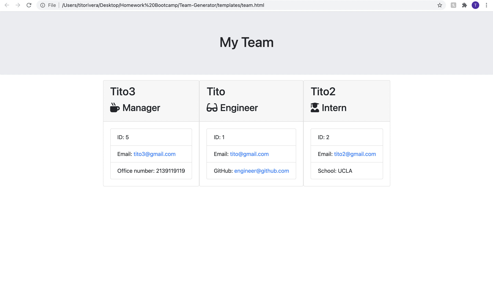

# Team Generator

### Motivation

* The motivation behind making this application is to make it easier to keep track of employees and teams within a work environment. This application would make it easier for managers and bosses of a company to set roles and get certain information from certain employees depending on their position within the company. This application would in turn allow you to send a link to everyone in a team so that they can also be aware of their team and role within that team.

### Features

* This application allows you to create teams within a command prompt and asks various questions for each role. This application is currently only geared towards engineering companies. It asks whether the employee is a manager, engineer, or intern within the team. After choosing a role within the team the application will ask for an email address. Once you have chosen your email it will then ask very particular questions to the certain role such as for interns it will ask about what school they attended.

### Build Status

* This application is currently in alpha because there is a lot more that needs to be added to make it fully functional for any work environment. It currently only allows for manager, engineer, and intern options when prompted but it has very limited options beyond that.

### Future Development

* For future development we would like to be able to make it more job specific rather than just for smaller engineering companies. We would like to make the application be able to ask the user what kind of company they work for and what kind of roles they would like to add for their copany and for their specific teams. It would also give more options in terms of what should be asked for each employee that is entered into the system. This application will also be able to be run in a browser window because it may be difficult for some people to have to go into the command prompt to be able to add team members or create teams altogether.

### Screenshots

*
*